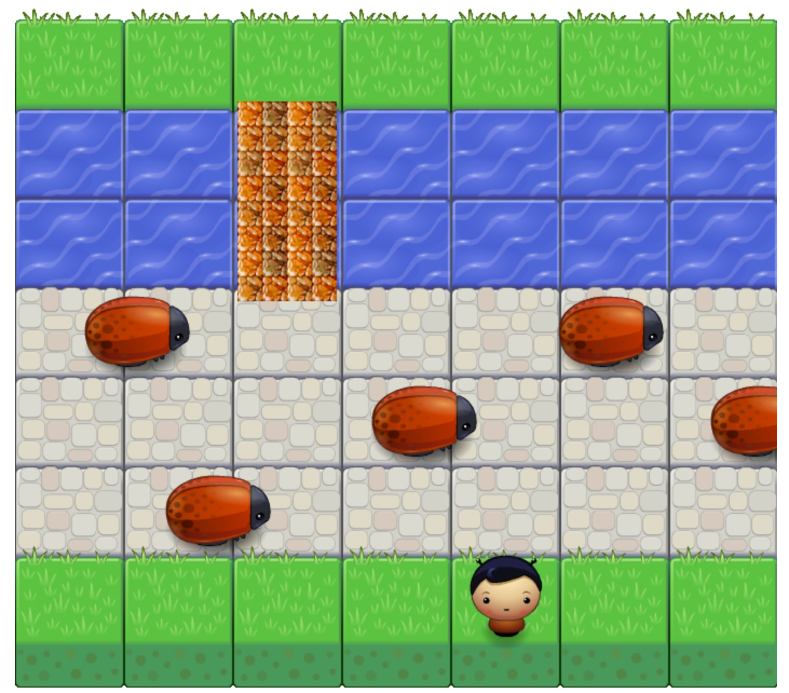

# Buggin' Boy!

This is a project for the Udacity Front End Developer nanodegree. It was forked from [this repo](https://github.com/udacity/frontend-nanodegree-arcade-game).

You can play this version [here](http://n8finch.github.io/frontend-nanodegree-arcade-game/).

## The Game
We've all played the classic arcade (and graphing calculator) game Frogger. This game has a similar goal.

- Move across the board.
- Cross the bridge to the other side (this will reset the game).
- Don't get eaten by bugs!!! 



### To Play

1. Download the game in .zip format from GitHub (on this page).
2. Unzip the file and open the index.html file in your browser of choice.
3. The game should instantly render (if it doesn't, check your Console for errors).
4. Using the arrow keys on your keyboard, navigate the player through the cobblestones, over the stone bridge, and safely to greener pastures...
5. ...but WATCH OUT for BUGS!!! If you get hit by a bug, you will move back to the starting row of grass in a random place, the bridge will also move, and you'll have to give it another go.
6. ***Hint:*** if you want to start with the bridge or the player in a different position, you can refresh the page, and your player and bridge will spawn in a random position.


### Changeing the number and speed of bugs

The easiest way to increase or decrease the level of difficulty is to change the number of bugs on the screen at a time, as well as their speed.

**To change the number**: in the `app.js` file, locate the following line of code:

```
var numEnemies = 5;
```
This is the number of active enemies on the game play at any given time. Increase the number for more enemies, decrease it for less.

**To change the speed**: in the `app.js` file, locate the following line of code:

```
this.speed = Math.floor(Math.random() * 400 + 75);
```
This is basically the "pixels per second" or p/s equation. The first number (in this case, 400), creates a random number between 0 and 400. In order to keep the bugs from moving an extremely slow pace, we add 75 to whatever number comes up. This means that the bugs will never move slower than 75 p/s. so, you can increase either number, the first is the range, the second is the minumum.

### Upcoming features

- Difficulty levels
- Points and lives
- Celebration dances

### Contributing

Feel free to fork this version and contribute. I'm always open to new ideas. 

## Original Notes From Udacity

Students should use this [rubric](https://www.udacity.com/course/viewer/#!/c-nd001/l-2696458597/m-2687128535) for self-checking their submission.

For detailed instructions on how to get started, check out this [guide](https://docs.google.com/document/d/1v01aScPjSWCCWQLIpFqvg3-vXLH2e8_SZQKC8jNO0Dc/pub?embedded=true).